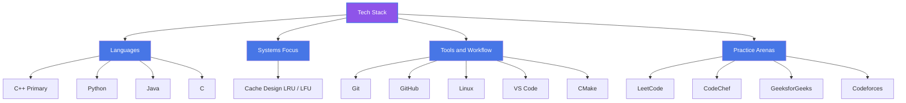

  

  

  
  
  
  
  

---

## 👨‍💻 About Me

B.Tech CSE student at **Invertis University, Bareilly**. Focused on C++, Data Structures & Algorithms, and understanding systems at a deeper level — from cache eviction policies to embedded hardware.

- 💻 Primary language: **C++**
- 🏆 Competitive programming across LeetCode, CodeChef, GeeksforGeeks
- 🌱 Open source enthusiast, GSoC aspirant
- 🎯 Preparing for SDE internships & entry-level software roles

---

## 🛠️ Tech Stack

  

| Focus | Tools & Languages |
|---|---|
| Primary | C++ |
| Also using | Python, Java, C |
| Systems | Cache design (LRU/LFU) |
| Version Control | Git, GitHub |
| Dev Environment | Linux, VS Code, CMake |

### 🌳 Tech Stack Tree

---

## 🚀 Featured Projects

<b>🗄️ LRU Cache Implementation (C++)</b>

 

O(1) Least-Recently-Used cache using a HashMap + Doubly Linked List.

**Tags:** `C++` `Hash Map` `Linked List` `System Design`

[→ View Repo](https://github.com/aakashk7092/LRU-Cache-DSA-Library)

<b>📊 LFU Cache with Frequency Tracking (C++)</b>

 

Extended the LRU design to track access frequency with LRU as a tiebreaker, keeping all operations O(1).

**Tags:** `C++` `Frequency Tracking` `Cache Eviction`

[→ View Repo](https://github.com/aakashk7092/LFU-Cache-CPP)

<b>🧩 LeetCode DSA Repository</b>

 

LeetCode C++ solutions organized by data structure/topic for quick review rather than scattered one-offs.

**Tags:** `C++` `Data Structures` `Algorithms`

[→ View Repo](https://github.com/aakashk7092/leetcode-cpp-dsa)

<b>⚔️ Codeforces Problems</b>

 

Contest and practice problem solutions.

**Tags:** `C++` `Competitive Programming`

[→ View Repo](https://github.com/aakashk7092/CODE-FORCES-PROBLEMS)

---

## 📊 Competitive Programming Profiles

  

  

| Difficulty (GeeksforGeeks) | Solved |
|---|---|
| Basic | 37 |
| Easy | 35 |
| Medium | 12 |
| Hard | 0 |
| **Total** | **84** |

| Platform | Profile | Notes |
|---|---|---|
| **GitHub** | [aakashk7092](https://github.com/aakashk7092) | 25 repositories |
| **LeetCode** | [aakashkumar2005](https://leetcode.com/aakashkumar2005) | Rank 54,421, 20 badges earned including a 365-day activity badge |
| **CodeChef** | [aakashk7092](https://www.codechef.com/users/aakashk7092) | 305 problems solved, Silver Problem Solver badge |
| **GeeksforGeeks** | [aakasho65a](https://www.geeksforgeeks.org/profile/aakasho65a) | 84 problems solved |
| **Codeforces** | [aakashkumar2005](https://codeforces.com/profile/aakashkumar2005) | Unrated, early stage on this platform |

---

## 📈 GitHub Analytics

  
  

  

  

---

## 🐍 Contribution Snake

  <picture>
    <source media="(prefers-color-scheme: dark)" srcset="https://raw.githubusercontent.com/aakashk7092/aakashk7092/output/github-contribution-grid-snake-dark.svg"/>
    <source media="(prefers-color-scheme: light)" srcset="https://raw.githubusercontent.com/aakashk7092/aakashk7092/output/github-contribution-grid-snake.svg"/>
    
  </picture>

---

## 🎓 Education

**B.Tech in Computer Science & Engineering**
Invertis University, Bareilly

---

  

  <i>Open to SDE internship opportunities, collaborations, and DSA discussions.</i>

