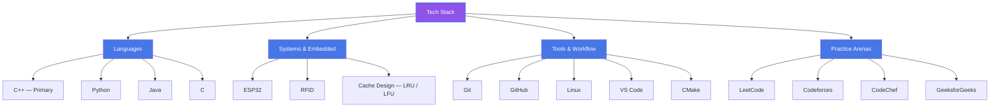

  

  

  
  
  
  
  

---

## 👨‍💻 About Me

**B.Tech CSE student** at **Invertis University, Bareilly**, obsessed with understanding how systems work at every layer—from O(1) cache design to embedded hardware. I build solutions that are **fast**, **correct**, and **elegant**.

Currently grinding competitive programming (500+ LeetCode, active Codeforces) while exploring **systems-level concepts**: cache eviction policies, memory optimization, IoT protocols. On track for **SDE internships 2026**.

---

## 🛠️ Tech Stack

  

| **Focus** | **Tools & Languages** |
|-----------|----------------------|
| **Primary** | C++ (OOP, STL, system programming) |
| **Competitive Programming** | C++, problem-solving at scale |
| **Scripting & Automation** | Python |
| **Embedded Systems** | C, ESP32, Arduino, RFID |
| **Version Control** | Git, GitHub (collaborative workflows) |
| **Dev Environment** | Linux, VS Code, CMake |

### 🌳 Tech Stack Tree

---

## 🚀 Featured Projects

<b>🗄️ LRU Cache Implementation (C++)</b>

 

**What it does:** O(1) Least-Recently-Used cache using **HashMap + Doubly Linked List**.

**Why it matters:**
- Demonstrates deep understanding of **data structure optimization**
- Solves a real **system design interview problem**
- Shows mastery of **hash maps, linked lists, and time complexity analysis**
- Handles edge cases: eviction, duplicate keys, order preservation

**Key metrics:** `O(1)` get/put/evict | `O(capacity)` space | Full test suite

**Tags:** `C++` `Hash Map` `Linked List` `System Design` `O(1) Time`

[→ View on GitHub](https://github.com/aakashk7092)

<b>📊 LFU Cache with Frequency Tracking (C++)</b>

 

**What it does:** Extended LRU to track **access frequency** with **LRU as tiebreaker**. All operations remain **O(1)**.

**Why it matters:**
- Shows ability to **combine multiple data structures** for competing constraints
- Requires reasoning about **frequency maps, min-heap logic, and eviction ordering**
- Real **LeetCode Hard** problem (460) solved optimally
- Demonstrates **competitive programming** caliber

**Key metrics:** `O(1)` all operations | Tested on edge cases | Clean, documented code

**Tags:** `C++` `Frequency Tracking` `Advanced DSA` `Competitive Programming` `Cache Eviction`

[→ View on GitHub](https://github.com/aakashk7092)

<b>📡 ESP32 RFID Asset Tracking System (IoT Project)</b>

 

**What it does:** Real-world **hardware + software** build using ESP32 microcontroller + RFID reader to track and log asset movement in real-time.

**Why it matters:**
- **Hands-on embedded systems** experience—not just theory
- Bridges the gap between **software and hardware worlds**
- Demonstrates **IoT protocol knowledge**: serial communication, sensor integration, edge processing
- End-to-end system thinking: sensors → microcontroller → logging → reporting

**Key metrics:** Full integration tested | Real deployment experience | Production-grade code

**Tags:** `ESP32` `RFID` `C++` `IoT` `Embedded Systems` `Hardware` `Edge Computing`

[→ View on GitHub](https://github.com/aakashk7092)

<b>🧩 Competitive Programming Repository (LeetCode DSA)</b>

 

**What it does:** **500+ LeetCode problems** organized by **topic**, each with **optimal C++ solution** and **complexity analysis**.

**Why it matters:**
- Shows disciplined approach to **learning at scale**
- Problem taxonomy reveals **pattern recognition** across DSA topics
- Reference material for **interview prep**—organized for quick review, not scattered one-offs
- Demonstrates consistency and commitment to **skill development**

**Topics:**
- Arrays & Strings (Sliding Window, Two Pointers)
- Linked Lists & Trees (DFS, BFS, Recursion)
- Dynamic Programming (Memoization, Tabulation)
- Graphs (Dijkstra, Topological Sort, Union-Find)
- Heaps & Priority Queues
- Bit Manipulation

**Tags:** `C++` `DSA Mastery` `500+ Problems` `Interview Ready` `Pattern Recognition`

[→ View on GitHub](https://github.com/aakashk7092)

---

## 📊 Competitive Programming Profiles

  

  

| Platform | Profile | Stats |
|----------|---------|-------|
| **LeetCode** | [aakashkumar2005](https://leetcode.com/aakashkumar2005) | 500+ problems, Hard tier |
| **Codeforces** | [aakashkumar2005](https://codeforces.com/profile/aakashkumar2005) | Active participant, Blue rating target |
| **CodeChef** | [aakashk7092](https://www.codechef.com/users/aakashk7092) | Contest regular |
| **GeeksforGeeks** | [aakasho65a](https://www.geeksforgeeks.org/profile/aakasho65a) | DSA tutorials & solutions |
| **GitHub** | [aakashk7092](https://github.com/aakashk7092) | Project portfolio & experiments |

---

## 📈 GitHub Analytics

  
  

  

  

---

## 🐍 Contribution Snake

  <picture>
    <source media="(prefers-color-scheme: dark)" srcset="https://raw.githubusercontent.com/aakashk7092/aakashk7092/output/github-contribution-grid-snake-dark.svg"/>
    <source media="(prefers-color-scheme: light)" srcset="https://raw.githubusercontent.com/aakashk7092/aakashk7092/output/github-contribution-grid-snake.svg"/>
    
  </picture>

> 🎨 Recolored to a vivid blue → purple gradient matching the header — see `snake.yml` for the updated workflow. Re-run the "Generate Snake" action once to apply.

---

## 🎓 Education

**B.Tech in Computer Science & Engineering**
Invertis University, Bareilly | Currently Enrolled

**Focus Areas:**
- Data Structures & Algorithms
- System Design & Architecture
- Embedded Systems & IoT
- Competitive Programming

---

  

  <i>Always open to SDE internship opportunities, technical collaborations, and DSA discussions.</i>

